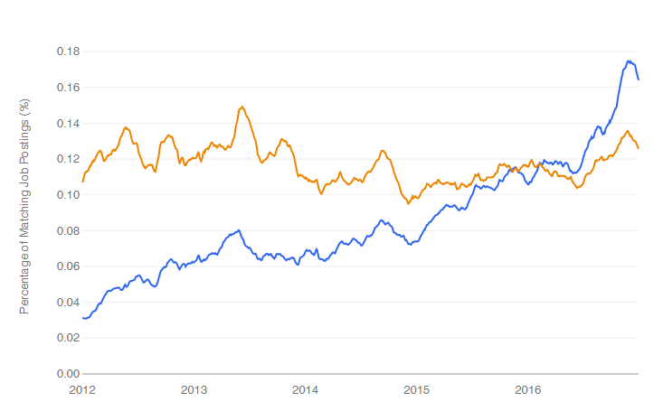
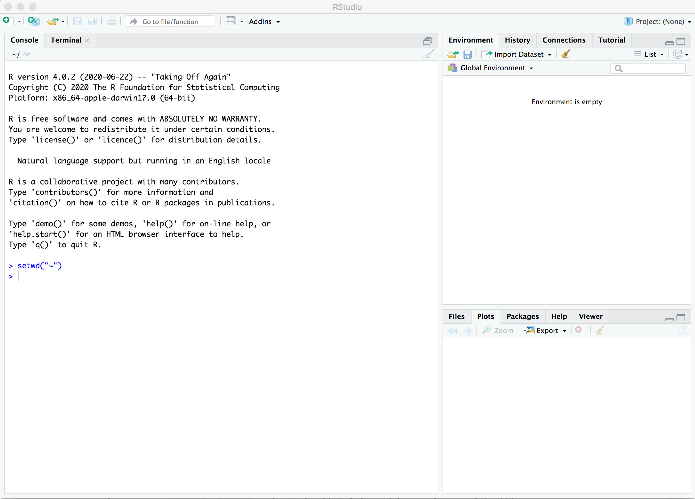

= GEOG5022 : Introduction to R I
By <https://www.roger-beecham.com[Roger Beecham]>
:icons: font
:source-highlighter: coderay
:imagesdir:
:task: sidebar
:aside: NOTE
:stem: latexmath
:fig: TIP
:toc: right

****
This session introduces a key technology for doing data analysis used widely in academia and industry: R. As well as learning what R is -- its history and use -- you will begin to perform some exploratory analysis in R on a real (spatial) dataset. The interface through which you'll interact with R is called RStudio. Both R and RStudio are free to use.

This first session provides much introductory material and discussion -- it requires some reading. Tomorrow's session will assume greater knowledge/familiarity and will be more task focussed.

By the end of this session you should be able to:

* open R using the RStudio Graphical User Interface (GUI)
* install and enable R libraries and query library documentation
* read in `.csv` files as R `DataFrames`
* perform data wrangling activities on R `DataFrames`
* calculate summary statistics over R `DataFrames`
* create statistical graphics using the `ggplot2` library
* generate a Choropleth map in R using the `tmap` library

****

[[introduction]]
== Introduction

++++
<iframe width="640" height="360"
  src="https://web.microsoftstream.com/embed/video/b4095e0e-e3cc-4b9c-9ab6-63669d5687d7?autoplay=false&amp;showinfo=true"
  allowfullscreen
  style="border:none;">
</iframe>
++++

For the next two sessions we'll be learning about a key technology for doing spatial data analysis: https://www.r-project.org[R]. It has origins in academia, but is now global in reach and used by an increasingly impressive number of organisations.

.Figure 1: Data science job trends for R (blue) and SAS (orange). In Munchen, R. (http://r4stats.com/articles/popularity/[online])
--

--

There is not sufficient time to discuss the fundamentals of the R language in depth. Rather, these sessions aim to give you a flavour and the most useful software and libraries for interfacing with R.

== What is R?

R is a free, open statistical programming language and environment. Released as open source software as part of a research project in 1995, for some time R was the preserve of academics. From 2010s onwards, with the advent of _Big Data_ and new sub-disciplines such as _Data Science_, R enjoyed rapid growth and is used increasingly outside of academia, by organisations such as Google [https://research.google.com/pubs/pub37483.html[example]], Facebook [http://flowingdata.com/2010/12/13/facebook-worldwide-friendships-mapped/[example]], Twitter [https://blog.twitter.com/official/en_us/a/2013/the-geography-of-tweets.html[example]], New York Times [http://www.nytimes.com/interactive/2012/05/05/sports/baseball/mariano-rivera-and-his-peers.html?ref=baseballexample[example]], BBC [https://bbc.github.io/rcookbook/[example]] and many more.

Rather than simply a free alternative to proprietary statistical analysis software such as SPSS, R is a programming language in and of itself and can be used for:

* Data Visualization design: https://www.rgs.org/geography/geovisualisation/voting-patterns-in-the-2019-general-election/?utm_source=Twitter&utm_medium=social&utm_campaign=SocialSignIn[2019 General Election DataVis] | https://threadreaderapp.com/thread/1317019462453895168.html[Covid-19 DataVis]

* Developing interactive (visualization) software:  https://gehlenborglab.shinyapps.io/upsetr/[UpSet]

* As a GIS: http://robinlovelace.net/geocompr/[Geocomp with R]

* As a word processor / web publisher: http://rmarkdown.rstudio.com/gallery.html[R Markdown]

== Why R?

=== Free, open-source with an active community

There are many benefits that come from being fully open-source, with a critical mass of users.

Firstly, there is a burgeoning array of online forums, tutorials and code examples through which to learn R. https://stackoverflow.com/questions/tagged/r[StackOverflow] is a particularly useful resource for answering more individual questions.

Second, with such a large community, there are numerous expert R users who themselves contribute by developing _libraries_ or _packages_ that extend its use.

[{aside}]
--
An R package is a bundle of code, data and documentation, usually hosted centrally on the CRAN (Comprehensive R Archive Network). A particularly important, though very recent, set of packages is the http://www.tidyverse.org[tidyverse]: a set of libraries authored mainly by http://hadley.nz[Hadley Wickham], which share a common underlying philosophy, syntax and documentation.
--

=== R supports **modern** data analysis workflows

[quote, Roger Peng, Jeff Leek and Brian Caffo]
____
Reproducible research is the idea that data analyses, and more generally, scientific claims, are published with their data and software code so that others may verify the findings and build upon them.
____

In recent years there has been much introspection around how science works -- around how statistical claims are made from reasoning over evidence. This came on the back of, amongst other things, a high profile paper published in http://science.sciencemag.org/content/349/6251/aac4716[Science], which found that of 100 recent peer-reviewed psychology experiments, the findings of only 39 could be replicated. The upshot is that researchers must now make every possible effort to make their work transparent. In this setting, traditional data analysis software that support point-and-click interaction is unhelpful; it would be tedious to make notes describing all interactions with, for example, SPSS. As a declarative programming language, however, it is very easy to provide such a provenance trail for your workflows in R since this necessarily exists in your analysis scripts.

Concerns around the _reproducibility crisis_ are not simply a function of transparency in methodology and research design. Rather, they relate to a culture and incentive structure whereby scientific claims are conferred with authority when reported within the (slightly backwards) logic of Null Hypothesis Significance Testing (NHST) and _p-values_. This isn't a statistics session, but for an accessible read on the phenomenon of _p-hacking_ (with interactive graphic) see https://fivethirtyeight.com/features/science-isnt-broken/#part1[this article] from the excellent http://fivethirtyeight.com[FiveThirtyEight] website. Again, the upshot of all this introspection is a rethinking of the way in which Statistics is taught in schools and universities, with greater emphasis on understanding through computational approaches rather than traditional equations, formulas and probability tables. Where does R fit within this? Simply put: R is far better placed than traditional software tools and point-and-click paradigms for supporting computational approaches to statistics -- with a set of methods and libraries for performing simulations and permutation-based tests.

== Task 1. Get familiar with the R and RStudio environment

++++
<iframe width="640" height="360" src="https://web.microsoftstream.com/embed/video/b7b18a20-bbd1-4f27-8474-a076f5c82673?autoplay=false&amp;showinfo=true" allowfullscreen style="border:none;"></iframe>
++++

=== Open RStudio

.Figure 2: Example RStudio interface.
--

--

[{task}]
--
[horizontal]
Instructions:: Open RStudio. Click `File` -> `New File` -> `R Script`.
--

You should see a set of windows roughly similar to those in the figure above. The top left pane is the _Code Editor_. This is where you'll write, organise and comment R code for execution. Code snippets can be executed using `Run` at the top of the RStudio pane or typing `cmd R` (Mac) `ctr R` (Windows).  Below this, in the bottom left pane is the _R Console_, in which you write and execute commands directly. To the top right is a pane with the tabs _Environment_ and _History_. The purpose of these will soon be clear. In the bottom right is a pane for navigating through project directories (_Files_), displaying _Plots_, details of installed and loaded _Packages_ and documentation on the functions and packages you'll use (_Help_).

=== Type some console commands

You'll initially use R as a calculator by typing commands directly into the _Console_. You'll create a variable (`x`) and assign it a value using the assignment operator (`<` `-`), then perform some simple statistical calculations using functions that are held within the (`base`) package.

[source]
--
# Create variable and assign a value.
x <- 4
# Perform some calculations using R as a calculator.
x_2 <- x^2
# Perform some calculations using functions that form baseR.
x_root <- sqrt(x_2)
--

[{task}]
--
[horizontal]
Instructions:: Type the commands contained in the code block above into your R Console. Notice that since you are _assigning_ values to each of these objects, these are stored in memory and appear under the _Global Environment_ pane.
--

[{aside}]
--
The `base` package is core and native to R. Unlike all other packages, it does not need to be installed and called explicitly. One means of checking the package to which a function you are using belongs is to call the help command (`?`) on that function: e.g. `?mean()`.
--

=== Install some packages

In these introductory sessions, you'll mainly be using a collection of _packages_ that form part of the so-called _tidyverse_. Do read some of the documentation provided from the http://www.tidyverse.org[project website] to learn more around its philosophy. The packages together provide a very intuitive means of interacting with R and support  analysis tasks that form most http://r4ds.had.co.nz/introduction.html[Data Science workflows].

There are two steps to making packages available in your working environment. `install.packages(<package-name>)` downloads the named package from a repository, `library(<package-name>)` makes the package available in your current session.

=== Read in some data

The sessions will cover a topic with which you're no doubt familiar: the UK's referendum vote on membership of the EU. You'll start by exploring the results data published at Local Authority level and made available in `.csv` form by https://www.electoralcommission.org.uk[The Elecctoral Commission]. You'll do so using the `readr` package (part of the _tidyverse_).

[source]
--
# Exploratory analysis of Brexit data.
#
# Author: <your-name>
#####################################

# Load required packages.
# Tidyverse. Uncomment if you have not already installed this.
# install.packages("tidyverse") #install
library(tidyverse) #load

# SimpleFeatures package for working with spatial data.
# Uncomment if you have not already installed this.
# install.packages("sf") #install
library(sf) #load

# tmap library uses syntax very similar to ggplot2.
# Uncomment if you have not already installed this.
# install.packages("tmap") #install
library(tmap) #load

# Read in results data. Note that the read_csv method belongs to the readr
# package. Whilst the baseR equivalent read.csv is also fine, read_csv reads in
# data as a special class of data frame (tibble).
referendum_data <- read_csv("https://www.electoralcommission.org.uk/sites/default/files/2019-07/EU-referendum-result-data.csv")
--

[{task}]
--
[horizontal]
Instructions:: In the editor pane of RStudio write the code and comments in the block above. Execute by clicking `run` or `cmd+r` (Mac) `ctr+r` (Windows). Then save the R script with an appropriate name like  `brexit_analysis.R`.
--

Notice that the results data now appears under the `Data` field of the _Environment_ pane. It is stored as a _data frame_ -- a spreadsheet-like representation where rows correspond to individual observations and columns act as variables. You can inspect a data frame as you would a spreadsheet by typing `View(<dataframe-name>)` or by pointing and clicking on the named data frame in the _Environment_ pane. You can also get a quick view on a data frame's contents by typing `glimpse(<dataframe-name>)`.

== Task 2. Perform some exploratory data analysis

++++
<iframe width="640" height="360" src="https://web.microsoftstream.com/embed/video/4a00d3b3-5a9c-404f-9b26-5977ee3b9a2f?autoplay=false&amp;showinfo=true" allowfullscreen style="border:none;"></iframe>
++++

=== Do some data wrangling

_Data wrangling_ type operations are supported by functions that form the _dplyr_ package. Again, _dplyr_ is within the family of packages that comprise the _tidyverse_. Its functions have been named with verbs that neatly describe their purpose -- `filter()`, `select()`, `arrange()`, `group_by()`, `summarise()` and more. The pipe (`%>%`) is a particularly handy operator that allows calls to these functions to be chained together.

[source]
--
# Calculate the LA share of Leave vote by Region.
region_summary <- referendum_data %>%
      group_by(Region) %>%
        summarise(share_leave=sum(Leave)/sum(Valid_Votes)) %>%
           arrange(desc(share_leave))
print(region_summary)
--

[{task}]
--
[horizontal]
Instructions:: Add the code block to your R script and run only that block above. Run `View(region_summary)`. Given the result that's printed to your R Console, consider each line in the code block. Hopefully you will appreciate that chaining functions in this way (e.g. using `%>%`) enables you to construct quite expressive code.

[horizontal]
Individual coding task:: Create two new variables in `referendum_data` -- one named `share_leave` and one named `margin_leave`. `share_leave` should express the Leave vote as a share of valid votes cast; `margin_leave` should contain the direction and size of margin of the Leave vote share. You will need to make use of the _dplyr_ function `mutate()`. Hint: to compute the size of margin, you will need to do some basic subtraction on the `share_leave` variable. Again, check that you have correctly created the variables by running `View(referendum_data)`.
--

=== Create some summary graphics

.Figure 3: Size of margin in favour of Leave:Remain by UK Local Authority.
--

--

`ggplot2` is a powerful and widely used package for producing statistical graphics -- and again a package that is core to the _tidyverse_. It has a very strong theoretical underpinning, based on a framework for data visualization known as http://www.springer.com/gb/book/9780387245447[_The Grammar of Graphics_] (Wilkinson 2005). The general approach is of treating graphical elements separately and building features in a series of layers.

[source]
--
# Code for creating additional variables (from the individual coding task).
referendum_data <- referendum_data %>%
                      mutate(share_leave=Leave/Valid_Votes,
                        margin_leave=share_leave-0.5 )

# Create ordered bar chart of result ordered by LA.
referendum_data %>%
  filter(Area!="Gibraltar") %>%
  ggplot(aes(x=reorder(Area,-share_leave), y=margin_leave, fill=margin_leave))+
  geom_bar(stat="identity", width=1)+
  scale_fill_distiller(palette = 5, type="div", direction=1, guide="colourbar", limits=c(-0.3,0.3))+
  scale_x_discrete(breaks=c("Lambeth","Slough","Boston")) +
  geom_hline(aes(yintercept=0))+
  theme_classic()+
  xlab("LAs by Leave (asc)")+
  ylab("Margin Leave/Remain")
--

[{task}]
--
[horizontal]
Instructions:: Add the code block above to your R Script and run. You should hopefully see in the _Plots_ window a graphic closely resembling Figure 3.

[horizontal]
Individual coding task:: Try experimenting with the `ggplot2` layers for yourself. You might want to start with a simpler plot -- for example the code block below, which produces a bar chart of the share of Leave vote by Region. Here vote share is mapped to bar length, but the bars are unordered and colour is not mapped to any data characteristic. Think about the ideas used in the LA-level bar chart to make a more data-rich graphic. Hint: if you were to order your bar chart by the Leave vote, you would want to reorder the x (category axis) using the function `reorder(Region,share_leave)`.
--

[source]
--
# Code for simple bar chart of regional summary data.
region_summary %>%
  ggplot(aes(x=Region, y=share_leave))+
  geom_bar(stat="identity")

--

[{aside}]
--
It is completely understandable if at this point you think somewhat tedious the whole idea of generating code to describe your graphics. However, once you learn how to construct graphics in this way -- once you learn the `ggplot2` grammar -- it is possible to very quickly generate relatively sophisticated exploratory graphics. That the grammar forces you to think more abstractly about data type and visual mapping is an important point. It introduces you to a key tenet of Information Visualization theory (http://esripress.esri.com/display/index.cfm?fuseaction=display&websiteID=190[Semiology of Graphics]) by stealth, but also encourages you to think in depth about your data, its structure and (since you're producing graphics) the insights that can be made from visualizing that structure.
--

== Task 3. Perform some exploratory spatial data analysis

++++
<iframe width="640" height="360" src="https://web.microsoftstream.com/embed/video/5fd28b89-a7bc-4eb6-a8a5-47f2b87cf42c?autoplay=false&amp;showinfo=true" allowfullscreen style="border:none;"></iframe>
++++

=== Load in some spatial (and other attribute) data

[source]
--
# A pre-prepared simple features data frame that loads Local Authority outlines
# (as sfc_MULTIPOLYGON) and 2011 Census data that we'll use
# to model the vote for the remaining sessions.
data_gb <- st_read("http://www.roger-beecham.com/GEOG5022M/data/data_gb.geojson")
--

[{task}]
--
[horizontal]
Instructions:: Add the code block above to your R Script and run. This might take a while to execute. You should hopefully see in the _Data_ window a new data frame called `data_gb`.
--

[{aside}]
--
The data frame we've called `data_gb` is a special class of data frame to the extent that it contains a `list-col` variable (called `geometry`) in which are stored coordinates defining the spatial extent of Local Authority boundaries. Storing spatial information in this way is made possible via the _Simple Features_ (`sf`) package. The details of this package and of spatial data handling in R are beyond the scope of this introductory session. If you are keen to push on with R, it is worth exploring how the boundary data is loaded and linked to the Census attribute data by downloading the http://www.roger-beecham.com/GEOG5022/code/load_data.R[load_data.R] script. Also worth investigating is http://robinlovelace.net/geocompr/[Geocomputation with R], authored by http://robinlovelace.net[Robin Lovelace] (of Leeds) and others.
--

=== Explore spatial variation in the Leave:Remain vote

In this section, you will analyse variation in EU referendum voting behaviour by Local Authority by generating various Choropleth maps. You will do so using the https://github.com/mtennekes/tmap[tmap] package: a new, user-friendly library that adopts a syntax similar to that of `ggplot2`.

The general form of a _tmap_ specification:

* A data frame containing a geometry field `(sfc_MULTIPOLYGON)` must be supplied to `tm_shape()`.
* To `tm_fill()`, we identify the variable values on which polygons should be coloured as well as information such as the colour mapping (sequential, diverging or continuous) and palette to use.
* `tm_layout()` provides control over titles, legends etc.

[source]
--
# Generate a choropleth displaying share of leave vote by Local Authority area.
tm_shape(data_gb) +
  tm_fill(col="share_leave", style="cont", size=0.2, id="geo_label", palette="Blues", title="") +
  tm_borders(col="#bdbdbd", lwd=0.5) +
  tm_layout(
    title="LA share of Leave vote",
    title.snap.to.legend=TRUE,
    title.size=0.8,
    legend.text.size=0.6,
    title.position = c("right", "center"),
    legend.position = c("right","center"),
    frame=FALSE,
    legend.outside=TRUE)
--

[{task}]
--
[horizontal]
Instructions:: Add the code block to your R script Run. You should see a map resembling that in the left of Figure 3.

[horizontal]
Individual coding task:: Create a new Choropleth that displays the _margin_ in favour of Leave:Remain (a spatial equivalent of Figure 4). You will need to affect the column (`col=`) to which `tm_fill()` maps, as well as the palette (`palette=`) that is used (it should be `"RdBu"`). Remember, if you need more information about  parameter options type `?<method-name>` into the R Console. Your map should look similar to the second map from the left in Figure 4.

[horizontal]
Individual coding task::  An obvious problem with displaying social phenomena on a conventional map is that visual salience is given to rural areas where relatively few people live, with patterns in urban areas de-emphasised.  A partial solution is to split our map on the `Region` variable, resulting is a set of small multiple choropleths. This can be achieved with a call to `tm_facets(<"variable-name">)`. Adapt your code used to generate the choropleth map with this addition (e.g. `+ tm_facets("Region", free.coords=TRUE)`). You should end up with a map resembling the second from the right in Figure 4.

[horizontal]
Instructions:: An alternative and more direct approach to dealing with the salience bias of rural areas is through a https://en.wikipedia.org/wiki/Cartogram[cartogram]. Cartograms allow spatial units (Local Authorities in this case) to be sized according to the phenomena of interest. Copy the code block below to create a cartogram similar to that presented in the right of Figure 4.
--

[source]
--
# Install cartogram package.
install.packages("cartogram")
library(cartogram)
# Construct a new data frame, using the cartogram_cont() function, passing as a
# parameter into the function the variable to which polygons are to be sized:
# total_pop (number of voters in LA). This may take a while.
data_gb_carto <- cartogram_cont(data_gb %>% st_transform(crs=27700), "total_pop", itermax=10)

# Generate a choropleth using the same specification used in the conventional map,
# but supplying the new data frame to tm_shape:
# e.g. tm_shape(data_gb_carto) +
#        etc.
--

.Figure 4: Choropleths displaying the Leave:Remain vote by UK Local Authority.
--

--

[{aside}]
--
A cool feature of the `tmap` library is that it has an interactive mode, providing http://wiki.openstreetmap.org/wiki/Slippy_Map[slippy map] type functionality. This can be set with `tmap_mode("view")`. Enter this line into the R _Console_ and then re-run the code that generates the Choropleth. To reset back to static mode use `tmap_mode("plot")`.
--

== Task 4. Data challenge

Despite seeing various iterations of these maps in the weeks after the referendum, the very obvious contrast between most of England & Wales (Leave) and Scotland and London, as well as certain university cities and towns (Remain), is surprising. Notice the spot of dark red in the East of England representing Cambridge.

[{task}]
--
[horizontal]
Individual coding task:: Can you come up with hypotheses as to why these differences in voting behaviour exist? Might the differences relate to differing characteristics of the underlying population?  Try plotting choropleth maps of some of the Census variables that are stored in the `data_gb` data frame. Do ask the demonstrators if you need help with wrangling R or the `tmap` library.

[horizontal]
Instructions:: Once you have finished your data analysis, save the R session with a sensible name by selecting `Session`, `Save Workspace As ...`, provide a sensible name and save to a sensible directory so that it can be returned to in the next session.
--

== Task 5. Coding exercises (optional)

Once you have finished exploring spatial structure in these demographics, try to develop your R skills by performing the coding operations listed below.

[{task}]
--
[horizontal]
Individual coding task::  Try writing commands to:
* Calculate the _share of Leave_ vote for the whole of GB.
* Find the Local Authority (LA)  with the highest and lowest _share of Leave_ vote.
* Find the top 10 LAs most in favour of Leave and top 10 most in favour of Remain.
* **Advanced** Use `ggplot2` to generate https://en.wikipedia.org/wiki/Box_plot[box plots] displaying distributions of the Census variables.
--

== Further reading

There is a burgeoning set of books, tutorials and blogs introducing R as an environment for applied data analysis. Detailed below are resources that are particularly relevant to the material and discussion introduced in this session.

=== R for data analysis

* Healey, K. (2019), http://socviz.co/index.html[Data Visualization for Social Science: A practical introduction with R and ggplot2].  Excellent resource -- an engaging read that manages to integrate key Information Visualization theory and using real social science datasets.

* Kay, M. & Heer, J. (2016) https://github.com/mjskay/ranking-correlation[Analysis code for "Beyond Weber's Law: A Second Look at Ranking Visualizations of Correlation"]. Reading others' data analysis using R is often instructive. http://mjskay.com[Matt Kay], who has research interests in usable statistics and the reproducibility crisis, routinely publishes full data analysis code and documentation for his research papers.

* Lovelace, R., Nowosad, J. & Muenchow, J. (2019) http://robinlovelace.net/geocompr/[Geocomputation with R], CRC Press. Written by Robin Lovelace (University of Leeds) and others, this book comprehensively introduces spatial data handling in R. It is a great complement to _R for Data Science_ in that it draws on brand new libraries that support _Tidyverse_-style operations on spatial data.

* Wickham, H. & Grolemund, G. (2017), http://r4ds.had.co.nz[R for Data Science], O'Reilly. _The_ primer for doing data analysis with R. Hadley presents his _thesis_ of the data science workflow and illustrates how R and packages that form the _Tidyverse_ support this. It is both accessible and coherent and is highly recommended.

=== New Statistics and the reproducibility crisis (non-essential)

* Aschwanden, C. & King, R. (2015) https://fivethirtyeight.com/features/science-isnt-broken/[Science Isn’t Broken: It’s just a hell of a lot harder than we give it credit for]. A lovely take on the reproducibility crisis, published on http://fivethirtyeight.com[FiveThirtyEight] with an excellent interactive graphic.

* Cumming, G. (2013) http://journals.sagepub.com/doi/abs/10.1177/0956797613504966[The New Statistics: Why and How]. Geoff Cumming exposes  common misconceptions associated with NHST and makes a case for a New Statistics, centred on estimation-based approaches.  Despite the pre-historic graphics, his https://www.youtube.com/watch?v=3FjoUOolOYQ[dance of the p-values] video is well worth a watch.
