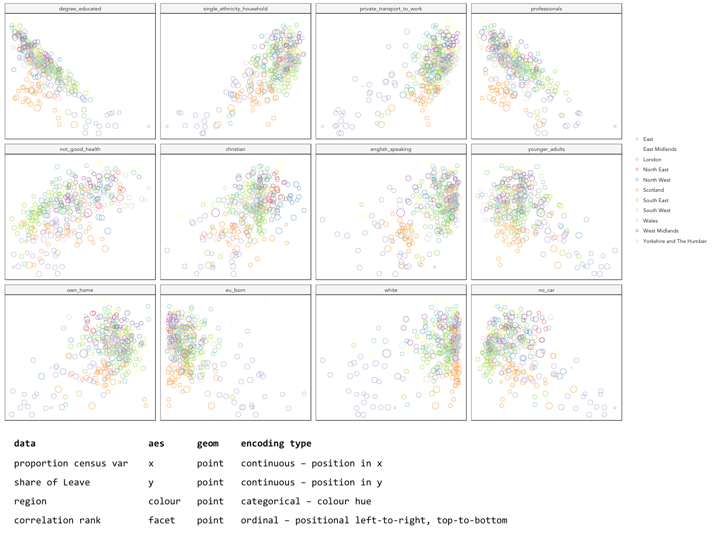
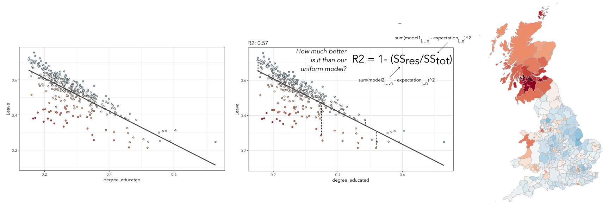
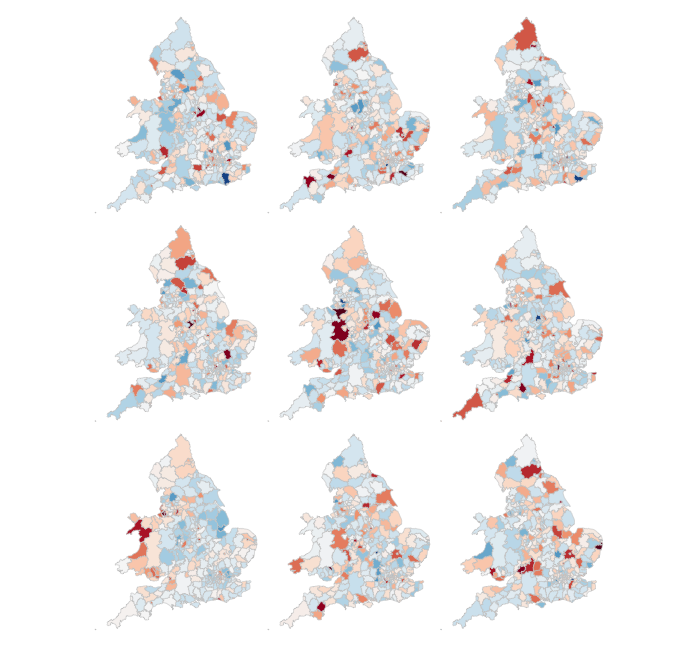
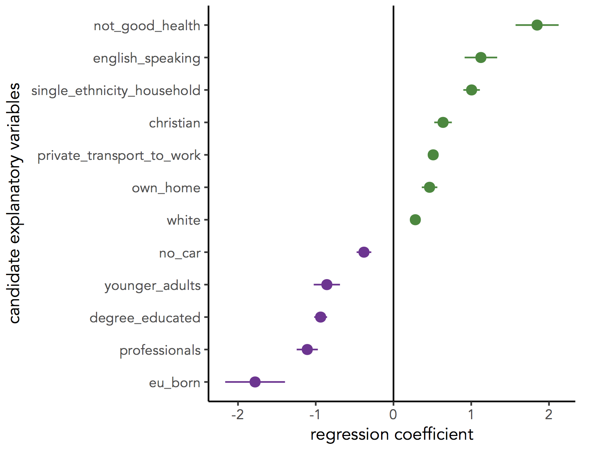

= GEOG5022 : Introduction to R II
By <https://www.roger-beecham.com[Roger Beecham]>
:icons: font
:source-highlighter: coderay
:imagesdir:
:task: sidebar
:aside: NOTE
:reminder: TIP
:stem: latexmath
:fig: TIP
:toc: right

****
In this session you will continue to learn about R as a technology for doing data analysis, again using the somewhat depressing Brexit result as a case study.  This session will be more practical-focussed (and analytically involved) than the last. You will use R to generate insights into the demographics behind the Brexit vote.

By the end of this session you should be able to:

* generate graphical small multiples using `ggplot2`
* make use of more advanced _tidyr_ functions, such as `pivot_longer(), pivot_wider()`, for preparing R data frames for charting
* calculate summary statistics over your datasets
* perform a linear regression analysis and use graphics to make decisions about model fit
* learn about permutation-based approaches to statistical testing

****

== Task 1. Explore bivariate relationships using correlation

.Figure 1: Scatterplots containing varying extents of correlation coefficient.
--

--

You finished the last session by plotting maps of the Leave:Remain vote and of different Census variables. Visually scanning across the maps, you might have observed that variation in the vote by Local Authority (LA) tends to co-vary with variation in the demographic characteristics of LAs. Any systematic co-variation would be interesting given the popular discourse on the Leave:Remain vote -- that Leave represented those people and places structurally https://www.theguardian.com/politics/2016/jun/25/left-behind-eu-referendum-vote-ukip-revolt-brexit[left behind] by economic change.

Any covariation in voting behaviour and demographics can be analysed more directly through correlation analysis.  You will have learnt that the _correlation coefficient_ can be used to summarise the strength of linear association between two variables. It is a quantity that ranges from perfect negative correlation (-1) to perfect positive correlation (+1) and can be considered a measure of effect size to the extent that it describes how much of something (correlation in this case) exists.

The code below allows the share of Leave vote and demographic characteristics of LAs to be examined using this quantity (correlation coefficient) as well as visually through a scatterplot (created using `ggplot2`).

[source]
--
# Calculate correlation coefficient of share Leave by degree-educated.
data_gb %>%
  summarise(cor(share_leave, degree_educated))

# Generate scatterplot of share Leave by degree-educated.
data_gb %>%
  ggplot(aes(x=share_leave, y=degree_educated)) +
  geom_point(colour="#525252",pch=21, alpha=0.8) +
  theme_bw()
--

[{task}]
--
[horizontal]
Instructions:: Add the code block to your R script and Run.

[horizontal]
Individual coding task:: Try exploring the relationship between share of Leave and different Census variables stored in the `data_gb` data frame.
--

[{aside}]
--
Type `?cor()` into the R Console. There are different ways in which the correlation statistic can be calculated. You may have learnt earlier in the semester about robust statistics -- statistics that are insensitive to outliers. Try calculating correlation coefficients on `share_leave` and `eu_born` but change the correlation statistic calculated from `method="pearson"` to `method="spearman"`. Can you account for this difference? You may find it useful to generate a scatterplot of this correlation structure. If you're really sad, you might also want to explore the effect of outliers further by playing this http://guessthecorrelation.com[guess the correlation game] -- where you must estimate the amount of correlation displayed in a scatterplot.
--

== Task 2. Generate graphical small multiples

Data analysis relies heavily on comparison. You might ask:

* How do current rates of smoking in a small area **compare** to other small areas with similar population dynamics?
* When **compared** with previous years, does the increase in smoking rates between 2016-2017 represent a significant shift?

Such comparisons can soon become complex and multifaceted.

One visualization solution for supporting such detailed comparison is https://en.wikipedia.org/wiki/Small_multiple[small multiples] -- a set of graphics juxtaposed next to one another, ideally in a meaningful order, such that they can be compared. For a deeper overview, check out  https://flowingdata.com/tag/small-multiples/[Nathan Yau's discussion] of small multiples.

`ggplot2` and related packages usefully support small multiples with functions such as `facet_wrap()`. A requirement of calls to these various `facet` functions is https://cran.r-project.org/web/packages/tidyr/vignettes/tidy-data.html[Tidy] data -- that is, where just one observation appears per row. Rows in the the data frame are then split and a separate chart is created for each tranche of data.

To generate small multiples of the scatterplots in the previous section -- share of Leave against Census variables -- we have to collapse our data frame such that a single row is given to each Local Authority (LA) _and_ Census variable -- basically we need to make our data frame taller and thinner. The _tidyr_ package provides methods that allow these types of operations. In the code block below the `pivot_longer()` method is used to collapse multiple columns into rows. Remember you can check the documentation for this function by typing into the R Console `?pivot_longer`.

[source]
--
data_gb %>%
  st_drop_geometry() %>%
  pivot_longer(cols=c(younger_adults:eu_born), names_to= "expl_var", values_to="la_prop") %>%
  ggplot(aes(x=la_prop, y=share_leave))+
  geom_point(colour="#525252",pch=21)+
  facet_wrap(~expl_var, scales="free")+
  theme_bw()
--

[{task}]
--
[horizontal]
Individual coding task:: Use the code above to generate small multiple scatterplots and maps similar to those appearing in Figure 2. Notice that the scatterplots are more efficient, data-rich graphics than those in the code provided above. Think about how to engineer the _ggplot2_ grammar in order to generate similarly data-dense graphics.
--

.Figure 2: Scatterplots of share of Leave against key explanatory variables accompanied with a summary of the chart grammar.
--

--

[{aside}]
--
Whilst one form of _untidy_ data is observations distributed amongst columns, the reverse is also common -- where observations are duplicated amongst rows. _tidyr_ provides a helper function (`pivot_wider()`) that has the reverse effect to `pivot_longer()` -- this spreads duplicated observations amongst columns, creating new variables and making the data frame wider.
--

== Task 3. Build, explore and test models

=== Create a univariate linear model

In the previous task you explored variables that not only correlate with the share of Leave vote but also correspond to phenomena that might help explain variation in the vote. We can try to build models that attempt to quantify this -- that allow estimates of the _effects_ of variables on the Leave vote.

As suggested visually and by its correlation coefficient (_r. -0.76_), there appears to be a strong negative linear association between the Leave vote and proportion of residents in LAs educated to _degree-level_ and above. We can _model_ for this relationship and talk about the effect of _degree-educated_ (explanatory variable) on the Leave vote (outcome) using linear regression. First, a  best fit line representing this linear model can be added to the scatterplot with the command: `geom_smooth(method = "lm", se = FALSE)`. We can also generate an object holding this model with the `lm()` command.

[source]
--
# Add OLS regression line to the scatterplot.
data_gb %>%
  ggplot(aes(x=degree_educated, y=share_leave))+
  geom_point(colour="#525252",pch=21)+
  geom_smooth(method = "lm", se = FALSE, colour="#525252")+
  theme_bw()

# Generate a univariate linear model object regressing the Leave vote on the
# degree-educated variable. Store object with name "lm_degree_educated".
lm_degree_educated <- lm(share_leave ~ degree_educated, data = data_gb)

summary(lm_degree_educated)
# output
# Call:
# lm(formula = share_leave ~ degree_educated, data = data_gb)
#
# Residuals:
#     Min       1Q   Median       3Q      Max
# -0.26244 -0.01661  0.01646  0.04377  0.13250
#
# Coefficients:
#                Estimate Std. Error t value Pr(>|t|)
# (Intercept)      0.79723    0.01227   64.95   <2e-16 ***
# degree_educated -0.93703    0.04148  -22.59   <2e-16 ***
# ---
# Signif. codes:  0 ‘***’ 0.001 ‘**’ 0.01 ‘*’ 0.05 ‘.’ 0.1 ‘ ’ 1
#
# Residual standard error: 0.06804 on 378 degrees of freedom
# Multiple R-squared:  0.5745,	Adjusted R-squared:  0.5733
# F-statistic: 510.3 on 1 and 378 DF,  p-value: < 2.2e-16
--

[{task}]
--
[horizontal]
Instructions:: Run the code in the block above. You can generate a summary of the model output with the following call: `summary(<model-object>)`.
--

[{aside}]
--
If you're new to regression and the output of the `summary()` function means nothing to you, don't worry. This is a reminder to say that we'll interpret this output together during the session (and below).
--

=== Inspect residuals from the univariate model

The regression coefficients that appear after calls to `summary(<model-object>)` simply describe the regression line -- and the regression line tells us, on average, what the Leave vote would be if it were entirely dependent on the proportion of the population educated to degree-level.  Since there is a strong negative association between Leave and _degree-educated_, the _slope_ of the regression line is negative. The coefficient for _degree-educated_ (`Estimate Std. -0.937`) can be interpreted as: a one unit increase in the _degree-educated_ population in a LA has the effect of decreasing the Leave vote by c.0.94 units.

But how successful is this model? To what extent is variation in the Leave vote entirely a function of variation in the proportion of people in LAs educated to _degree-level_? It is possible to quantify how well the model fits the data, and importantly _where_ it fits the data, by calculating _residuals_. Residuals are simply the difference between an observed value and the value expected by the model. The coefficient of determination (R-squared), a quantity you may have encountered earlier in the term, is simply the sum of squared residuals divided by the squared sum of total residuals (or variance). It tells us how much of the variation in the outcome can be accounted for by the model. In this case 57% of variation in the observed Leave vote can be explained with variation in the _degree-educated_ variable  (see output screen).

Ideally residuals should follow a https://en.wikipedia.org/wiki/Normal_distribution[normal distribution] and distribute randomly around the regression line, with no obvious systematic structure. One means of testing for normality is to simply generate a histogram on the residual variable, as in the block below.

[source]
--
# Extract and store model residuals
data_gb$resids_degrees = as_tibble(resid(lm_degree_educated))$value
# Plot histogram of residuals.
data_gb %>%
  ggplot(aes(resids_degrees))+
  geom_histogram()
--

As can be seen from the histogram, the distribution of residuals is closer to log normal. Inspecting the scatterplot, there is a group of LAs with observed Leave vote shares much lower than expected by our model. Plotting them spatially, we find that they are overwhelmingly concentrated in Scotland. Given the very clear break with Scotland and the rest of the country, there is a strong argument for developing a separate model for England & Wales. Rather than a smooth spatial process, which we sometimes see in maps of residuals, Scotland is categorically distinct.

.Figure 3: Residuals and R2 explained.
--

--

[{task}]
--
[horizontal]
Instructions:: Run the code in the block above to generate a scatterplot and map of residuals.

Individual coding task:: Generate a new data frame containing data for England & Wales (EW) only. You will need to use the `filter()` function and the `Region` variable to do this. Then create an EW-only linear model regressing _degree-educated_ on Leave. Make a note of the R-squared value for the EW-only model. Then generate a map and scatterplot of residuals using a visual grammar similar to that appearing in Figure 3. You may find Task 3 from yesterday useful. How are these residuals distributed around the regression line and across the country?
--

=== Study spatial autocorrelation in residuals

If you successfully completed the _individual coding task_ and generated a map and scatterplot of residuals from a linear model regressing _Leave_ on _degree-educated_, you will have observed that the residuals distribute reasonably nicely (randomly) around the regression line of the scatterplot. The choropleth map on EW-only data suggests that there may still be spatial structuring to the residuals -- patches of red and blue of similar intensities tend to collect together.

Geographers typically test for _spatial autocorrelation_ such as this using spatial statistics -- you may have already encountered https://en.wikipedia.org/wiki/Moran%27s_I[Moran's I], a measure of effect size for spatial autocorrelation. They do so by comparing an observed value of Moran's I against a theoretical distribution that would result under _complete spatial randomness_ (CSR) -- in this case, this is the assumption that regression residuals distribute around LAs in EW entirely independent of location.

An alternative approach is to perform such a test visually -- comparing the observed Choropleth against a set of Choropleths that one might expect to see under CSR (or some other sensible assumption -- https://www.gicentre.net/maplineups[Beecham et al. 2017]). The code below enables such a _graphical inference_ test (http://ieeexplore.ieee.org/document/5613434/[Wickham et al. 2010]).

[source]
--
# Function for generating map line-up test
do_lineup <- function(data) {
  real <- sample(1:9,1)
  for(i in 1:12) {
    if(i==real) {
      data <- cbind(data, data$value)
      colnames(data)[i+1] <- paste("p", i, sep = "")
    }
    else {
      permutation <- sample(data$value,nrow(data))
      data <- cbind(data, permutation)
      colnames(data)[i+1] <- paste("p", i, sep = "")
    }
  }
  # Draw maps
  map <- tm_shape(data) +
    tm_fill(c("p1","p2","p3","p4","p5","p6","p7","p8","p9"),style="cont", palette="RdBu")+
    tm_borders(col="gray80", lwd=1)+
    tm_layout(legend.show=FALSE, frame=FALSE, title.size = 0.8,title.position = c("right", "bottom"))
    tm_layout(legend.show=FALSE, frame=FALSE)
  print(map)
  print(real)
}
# Do line-up on EW model
do_lineup(data_gb %>% filter(Region!="Scotland") %>%  select(geometry, value=resids_degrees))
--

.Figure 4: Map LineUp on residuals from the EW-only model.
--

--

== Task 4. Data challenge

[{task}]
--
[horizontal]
Individual coding task:: Explore relationships between the Leave vote and the 12 Census variables held in the `data_gb` data frame. You may choose to generate scatterplots showing _share Leave_ against these explanatory variables before building separate linear regression models for each Census variable. You may also wish to investigate (perhaps visually initially) wether relationships between _share Leave_ and Census variables differ for different parts of the country.
--

== Assessed Task

This is a short, assessed task. It does not assume knowledge or coding skills above what you have learnt in the previous two sessions.

The task is designed to assess your:

* ability to produce outputs in R
* understanding of data types and their encoding through statistical graphics
* interpretation of quantitative structure in datasets

You can quickly glance at the assessed task below. However, the document into which you'll need to upload your answers can be found on _Minerva_, under this module (_GEOG5022M_), then _Learning Resources_. Click on this session's folder (`Week 5 - Friday - R II`). You should see a word document called `GEOG5022 - PPD Assessment Template - R.docx`. Download this document to a local directory -- this is the document you will use to paste in your answers. Once you've completed the task, save the document using the filename `PPD_R_<StudentID>`. upload the completed document to _Turnitin_ -- again, a link is provided under `Week 5 - Friday - R II`.

=== Assessed task 1. Calculate

[{task}]
--
a. Calculate the _share of Leave_ vote for GB as a whole. Note that you will need to work on the `data_gb` data frame for this. Once you've generated and run the code, paste it and its output (from the R console) into `GEOG5022 - PPD Assessment Template - R.docx` for submission.

b. Working on the `data_gb` data frame, find the top 10 LAs most and least in favour of Leave and print out the Local Authority name and `share_leave` result. Paste the code and its output into  `GEOG5022 - PPD Assessment Template - R.docx` for submission. Hint: you may find useful the code block under Task 2 (from yesterday's session).

c. Calculate correlation coefficients for `share Leave` against the `eu_born` variable separately for each Region of GB. Again, paste the code and its output into `GEOG5022 - PPD Assessment Template - R.docx` for submission. Hint: as well as the `cor` function for calculating the correlation coefficient, you will need to make use of `group_by`.
--

=== Assessed task 2. Plot

[{task}]
--
a. Create a set of histograms displaying distributions of `share Leave` amongst LAs in Great Britain faceted by `Region`. Once you've created the plot, save it to a local folder by selecting `export`, `save as Image` along with the code snippet used to create it. Then paste the graphic and code into `GEOG5022 - PPD Assessment Template - R.docx` for submission.
--

=== Assessed task 3. Model and Map

[{task}]
--
a. Using the code developed as part of Task 3 and Task 4 of today's session, generate a scatterplot of _share of Leave_ against some demographic characteristic, calculate a linear model that assumes variation in the Leave vote to be a linear function of that demographic characteristic and colour the observations in the scatterplot (Local Authorities) by residual values from that model. Beside the scatterplot, create a map of residual values from the model for each Local Authority.  Your scatterplot and map should follow a visual grammar similar to that used in Figure 3 of yesterday’s session. Paste the graphic and code into `GEOG5022 - PPD Assessment Template - R.docx` for submission along with a summary of model fit and coefficients, generated by `summary(<model-object-name>)`.
--

== Optional aside for the interested R user

As part of _Task 4_ you may have considered fitting univariate models separately for each of the candidate explanatory variables from the 2011 Census. To help with this, we can use new packages -- https://github.com/tidyverse/purrr[`purrr`] and https://github.com/tidyverse/broom[`broom`] -- again  written under the _Tidy_ data design philosophy.

[source]
--
# Generate univariate models separately on each explanatory variable.
univariate_models <- data_gb %>%
  st_drop_geometry() %>%
  select(c(lad15nm, share_leave), younger_adults:eu_born) %>%
  pivot_longer(-c(share_leave, lad15nm), names_to="expl_var", values_to="la_prop") %>%
  group_by(expl_var) %>%
  nest() %>%
  mutate(model=purrr::map(data, ~lm(share_leave ~ la_prop, data=.)),
         tidy=purrr::map(model, broom::tidy)) %>%
  unnest(tidy) %>%
  filter(term != "(Intercept)")

# Differentiate sign on regression coefficients when plotting.
b1_sign <- c("#7b3294","#008837")

# Plot regression coefficients from separate univariate models.
univariate_models %>%
  mutate(sign=ifelse(estimate>0,"pos","neg")) %>%
  ggplot(aes(x=reorder(expl_var,estimate), y=estimate))+
  geom_pointrange(aes(ymin=estimate-2*std.error, ymax = estimate+2*std.error,colour = factor(sign)),
                  position=position_dodge(.9))+
  geom_hline(aes(yintercept=0))+
  theme_classic()+
  xlab("candidate explanatory variables")+
  ylab("regression coefficient")+
  scale_colour_manual(values=b1_sign)+
  coord_flip()
--

.Figure 4: Regression coefficients for univariate models fit separately for candidate explanatory variables.
--

--

== Further reading (non-essential)

* Beecham, R. et al. (2020) https://journals.plos.org/plosone/article?id=10.1371/journal.pone.0229974[Regionally-structured explanations behind area-level populism: An update to recent ecological analyses]. PLoS One, 15(3): e0229974. https://github.com/rogerbeecham/update-ecological-analyses[code].
* Beecham, R. et al. (2018) http://www.josis.org/index.php/josis/article/view/377[Locally-varying explanations behind the United Kingdom's vote to leave the United Kingdom]. _Journal of Spatial Information Science_, 16: 117-136.  https://github.com/rogerbeecham/brexit-analysis[code].
* Beecham, R. et al. (2017) http://ieeexplore.ieee.org/document/7539286/[Map line-ups: effects of spatial structure on graphical inference]. _IEEE Transactions on Visualization & Computer Graphics_, 23(1):391–400. We propose and evaluate through a large crowd-sourced experiment a particular approach to graphical inference testing using maps. Full data analysis code and talk is available at the https://www.gicentre.net/maplineups[paper website].
* Wickham, H. et al. (2010) http://ieeexplore.ieee.org/document/5613434/[Graphical Inference for Infovis]. _IEEE Transactions on Visualization and Computer Graphics_, 16(6):973–979. Hadley Wickham's seminal piece on graphical inference -- well worth a read, if only for his erudite description of statistical testing and NHST.
